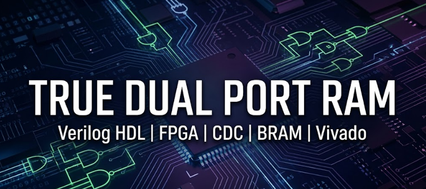
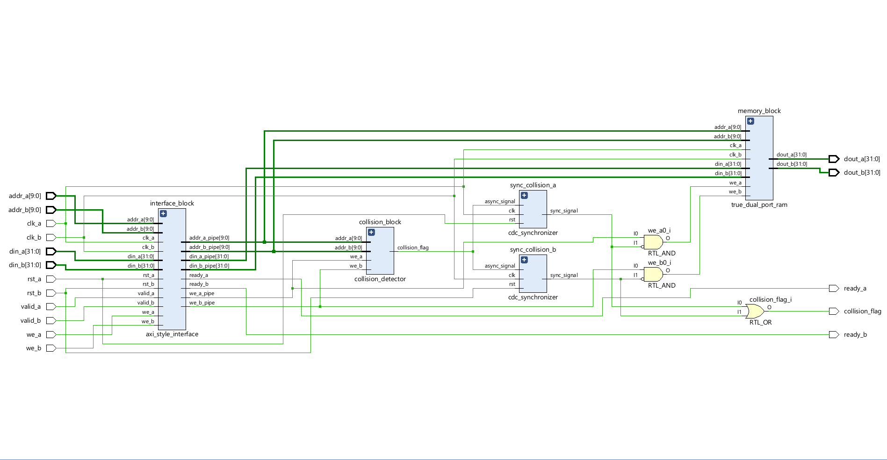
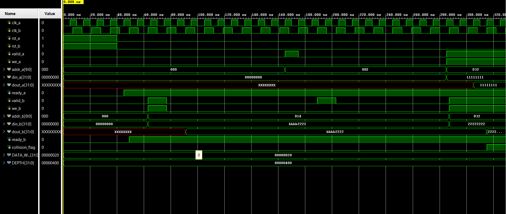

<p align="center">
  
</p>


#  True Dual Port RAM

A Verilog HDL project focused on designing an industrial-style asynchronous True Dual Port RAM subsystem for FPGA-based systems.

This project was built to understand how real-world memory architectures work inside modern digital systems and FPGA designs. Along with the RAM itself, the design also explores important concepts used in industry such as clock domain crossing (CDC), handshake-based communication, collision handling, and BRAM-friendly RTL coding.

---

## About the Project

In many digital systems, multiple modules need to access memory at the same time. A True Dual Port RAM allows two independent ports to read and write simultaneously, making it useful for high-speed and parallel hardware systems.

This project models that behavior using modular Verilog RTL and follows FPGA-oriented design practices compatible with Xilinx Vivado synthesis.

The design also introduces practical engineering concepts like:
- independent clock domains
- metastability handling
- synchronizer circuits
- collision detection
- modular RTL hierarchy

The goal of this project is not only to build RAM, but also to understand how industrial memory subsystems are designed step by step.

---

## Features

- True Dual Port RAM architecture
- Independent read/write ports
- Asynchronous clock support
- CDC-safe synchronizers
- VALID/READY style interface
- Collision detection logic
- Vivado-compatible BRAM inference
- Modular Verilog design
- Simulation-ready testbench

---

## Concepts Covered

This project helps in understanding:

- Memory fundamentals
- Single-port vs dual-port RAM
- True dual-port RAM operation
- FPGA BRAM architecture
- Clock Domain Crossing (CDC)
- Metastability
- Two-flop synchronizers
- Industrial RTL design methodology
- Collision handling
- FPGA-friendly coding style

---

## Project Structure

```text
True_Dual_Port_RAM/
│
├── rtl/
│   ├── DP_ram_top.v
│   ├── axi_interface.v
│   ├── trueDP_ram.v
│   ├── collision_detector.v
│   └── cdc_synchronizer.v
│
├── tb/
│   └── tb_DP_ram_top.v
│
├── docs/
├── waveforms/
│
├── README.md
└── LICENSE
```

---

## Module Description

### `DP_ram_top.v`
Top-level module integrating all memory subsystem components together.

### `trueDP_ram.v`
Core RAM module supporting simultaneous dual-port access.

### `axi_interface.v`
Implements a simple VALID/READY style communication interface inspired by industrial bus architectures.

### `collision_detector.v`
Detects simultaneous access conflicts when both ports target the same memory location.

### `cdc_synchronizer.v`
Implements two-flop synchronizers for safer signal transfer across clock domains.

### `tb_DP_ram_top.v`
Behavioral testbench used for functional verification and simulation.

---

## Tools Used

- Verilog HDL
- Xilinx Vivado
- FPGA BRAM
- Behavioral Simulation
---
## RTL Architecture
----



----

## Simulation Waveform
----


---
----
## What I Learned

While building this project, I explored:
- how FPGA memories are modeled in Verilog
- how asynchronous clock domains create challenges
- why CDC handling is important
- how dual-port architectures improve parallelism
- how modular RTL design is used in industry

This project also helped me better understand how larger systems such as FIFOs, AXI-based subsystems, and memory controllers are built internally.

---

## Future Improvements

Some planned future additions are:

- Asynchronous FIFO implementation
- AXI4 interface support
- Arbitration logic
- ECC (Error Correction Code)
- Built-In Self-Test (BIST)
- Parameterized RAM sizing
- Burst transfer support

---

## Author

Ashish Kumar Kashyap  
B.Tech Electronics & Communication Engineering  
MNNIT Allahabad

---

## License

This project is released under the MIT License for educational and learning purposes.
